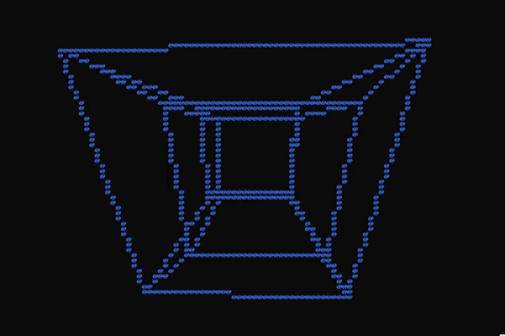

# Console Tesseract

Simple hypercube animation in console on C.

The result of combining [4-D mechanics](https://github.com/warrior-coder/CUBE-4D-TESSERACT) and [Console graphics](https://github.com/warrior-coder/CONSOLE-GRAPHICS-3D) together.

